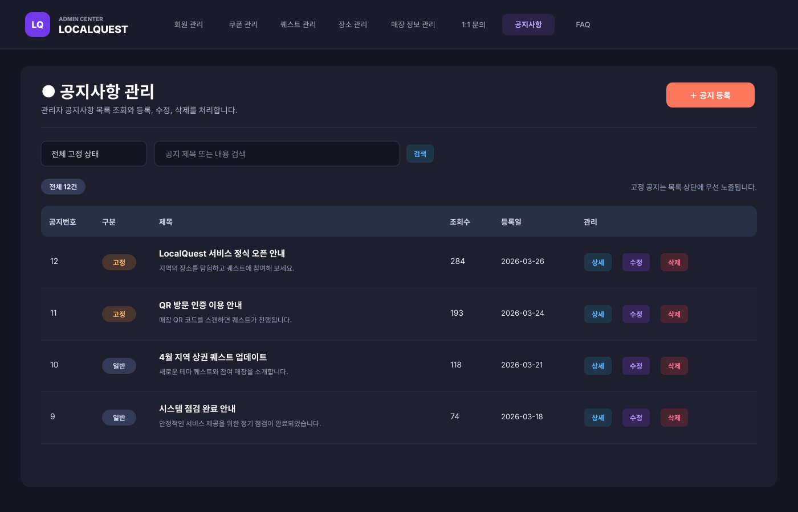
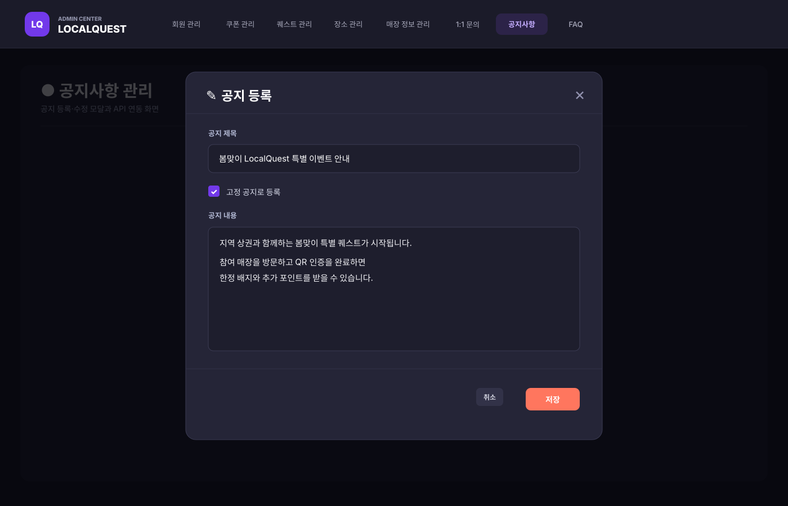
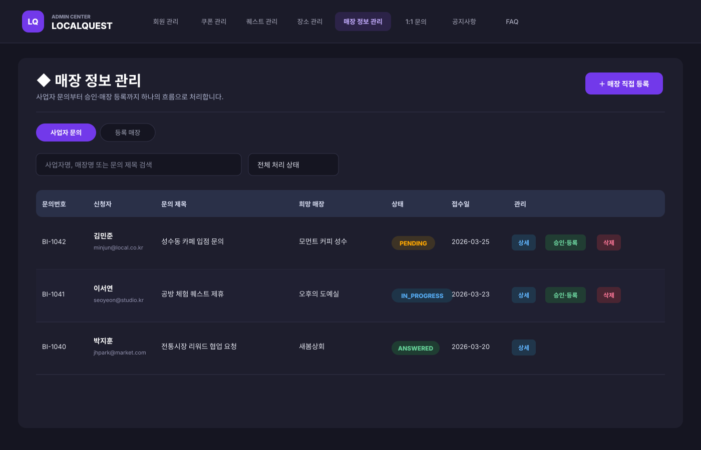
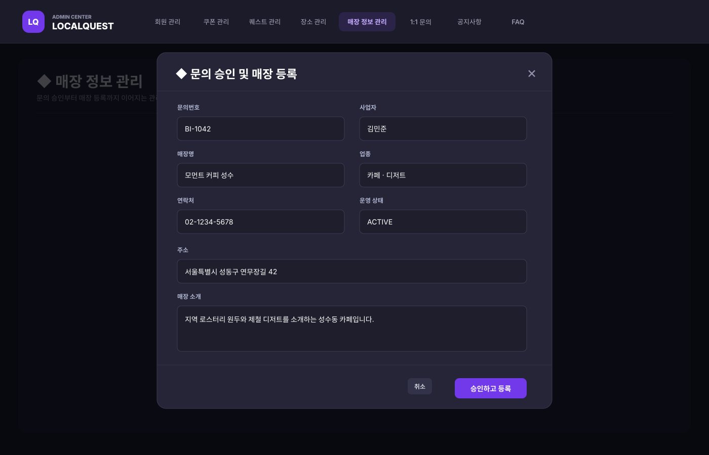

# LocalQuest

> 지역 상권을 퀘스트·QR 인증·리워드로 연결하는 참여형 로컬 플랫폼

## 프로젝트 소개

LocalQuest는 사용자가 지역의 장소를 탐색하고 퀘스트를 수행하면 포인트·배지·쿠폰을 받는 서비스입니다. 일반 사용자 화면은 React SPA로, 관리자·운영 화면은 Spring MVC와 JSP로 구성했으며 사업자 문의부터 매장 등록, 퀘스트 운영, 보상 관리까지 하나의 서비스 흐름으로 연결했습니다.

## 핵심 기능

### 사용자

- 회원가입·로그인, JWT 인증, 소셜 로그인 콜백
- 지역·테마 기반 퀘스트 탐색과 상세 조회
- QR 스캔을 통한 장소 방문 인증과 진행률 갱신
- 포인트, 배지, 등급, 랭킹, 쿠폰·보상 교환
- 마이페이지, 문의, 공지사항·FAQ
- 웹 푸시 구독과 알림 설정

### 사업자·관리자

- 사업자 제휴 안내와 입점 문의
- 문의 승인 후 매장 정보 등록·수정·삭제
- 퀘스트, 장소, 사용자, 보상, 공지사항 관리
- QR 발급·인증과 운영 지표 확인
- 관리자 공지사항 검색·고정·등록·수정·삭제

## 담당 구현

- 관리자 공지사항 목록·검색·상세·등록·수정·삭제 기능
- 사용자 조회수와 분리된 관리자 전용 공지 상세 조회
- 사업자 문의 목록·상세·상태 변경·삭제 기능
- 문의 승인부터 매장 등록까지 이어지는 관리자 처리 흐름
- Business DAO–Service–Controller와 관리자 JSP 화면 연동

## 담당 화면

원본 관리자 JSP·CSS 구조를 기준으로 포트폴리오용 대표 데이터를 표시했습니다.

### 관리자 공지사항 목록·검색·CRUD

### 공지 등록·수정

### 사업자 문의 처리

### 문의 승인 → 매장 등록

## 시스템 구조

~~~mermaid
flowchart LR
    A[React SPA] -->|REST API| B[Spring MVC]
    C[Admin JSP] --> B
    B --> D[Service]
    D --> E[DAO / MyBatis]
    E --> F[(Oracle DB)]
    B --> G[JWT / QR / Web Push]
~~~

## 기술 스택

| 영역 | 기술 |
|---|---|
| Frontend | React 19, Redux Toolkit, React Router, Axios, Sass |
| Backend | Java 11, Spring MVC 5.3, JSP/JSTL |
| Persistence | MyBatis, Spring JDBC, Apache DBCP2 |
| Database | Oracle |
| Auth | JWT, BCrypt |
| Feature | ZXing QR, Web Push, Java Mail |
| Build | Maven WAR, npm |

## 주요 화면 경로

| 경로 | 기능 |
|---|---|
| `/main` | 메인 페이지 |
| `/explore` | 퀘스트 탐색 |
| `/quest` | 참여 중인 퀘스트 |
| `/qr/verify` | QR 인증 |
| `/reward` | 보상·배지 |
| `/business` | 사업자 안내 |
| `/inquiry` | 사업자 문의 |
| `/mypage` | 사용자 정보 |
| `/support` | 공지·FAQ·문의 |

## 폴더 구조

~~~text
LocalQuest/
├── Backend/
│   ├── pom.xml
│   └── src/main/
│       ├── java/com/app/       # Controller, Service, DAO, DTO
│       └── webapp/WEB-INF/     # JSP, MyBatis Mapper, SQL
├── Frontend/
│   ├── package.json
│   ├── public/
│   └── src/                    # React pages, components, store
└── README.md
~~~

## 실행 방법

### Backend

~~~bash
git clone https://github.com/Eung-Seok/LocalQuest.git
cd LocalQuest/Backend
mvn clean package
~~~

Oracle 연결과 JWT·메일·푸시 관련 설정을 구성한 뒤 생성된 WAR 파일을 Servlet 컨테이너에 배포합니다.

### Frontend

~~~bash
cd LocalQuest/Frontend
npm install
npm start
~~~

개발 서버는 `http://localhost:3000`, API 프록시는 `http://localhost:8080`을 사용합니다.

### 환경변수

| 변수 | 용도 |
|---|---|
| `DB_URL` | Oracle JDBC URL |
| `DB_USERNAME` | Oracle 사용자 이름 |
| `DB_PASSWORD` | Oracle 비밀번호 |
| `LQ_JWT_SECRET` | JWT 서명 키(32자 이상) |
| `LQ_FILE_STORAGE` | 업로드 파일 저장 URI(예: `file:///tmp/localquest/`) |

실제 접속 정보와 서명 키는 저장소에 커밋하지 않고 실행 환경에서 주입합니다.

## 프로젝트 포인트

- 사용자·사업자·관리자의 서로 다른 흐름을 하나의 도메인 구조로 연결했습니다.
- QR 인증 결과가 퀘스트 진행률과 보상으로 이어지는 서비스 로직을 구현했습니다.
- React 사용자 화면과 JSP 관리자 화면이 동일한 Spring MVC 서비스 계층을 사용하도록 구성했습니다.
